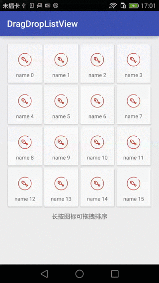

DragDropListView project
========================

This project can help developers implement drag and drop effects quickly.



Gradle
------
```
dependencies {
    ...
    compile 'cc.solart:dragdrop:1.0.0'
}
```

Usage
-----
write in the future with more examples


Changelog
---------
* **1.0.0**
    * Initial release

License
-------

    Copyright 2015 - 2016 solartisan/imilk

    Licensed under the Apache License, Version 2.0 (the "License");
    you may not use this file except in compliance with the License.
    You may obtain a copy of the License at

        http://www.apache.org/licenses/LICENSE-2.0

    Unless required by applicable law or agreed to in writing, software
    distributed under the License is distributed on an "AS IS" BASIS,
    WITHOUT WARRANTIES OR CONDITIONS OF ANY KIND, either express or implied.
    See the License for the specific language governing permissions and
    limitations under the License.