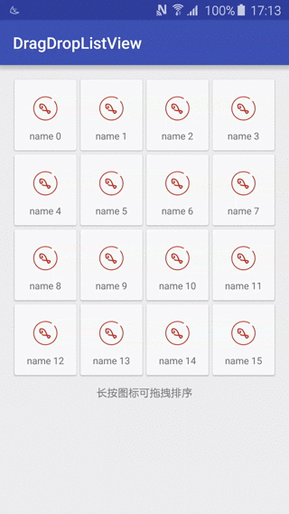
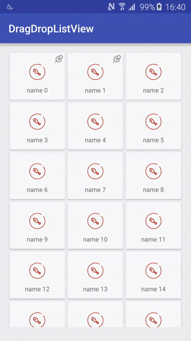

DragDropListView project
========================

This project can help developers implement drag and drop effects quickly.




Gradle
------
```
dependencies {
    ...
    compile 'cc.solart:dragdrop:1.1.0'
}
```

Usage
-----
you can use DragDropListView as GridView, just adding two attributes.
`<attr name="fixed_type" format="boolean"/>`,`<attr name="anim_duration" format="integer"/>`
```xml
<cc.solart.dragdrop.DragDropListView
        android:id="@+id/list_view"
        android:layout_width="match_parent"
        android:layout_height="match_parent"
        android:clipToPadding="false"
        android:divider="@null"
        android:horizontalSpacing="5dip"
        android:verticalSpacing="5dip"
        android:fadingEdge="none"
        android:nestedScrollingEnabled="true"
        android:numColumns="4"
        app:fixed_type="true"/>
```
you must layout a ImageView for drag shadow
```xml
<FrameLayout
        android:id="@+id/activity_overlay"
        android:layout_width="match_parent"
        android:layout_height="match_parent">

        <ImageView
            android:id="@+id/tile_drag_shadow_overlay"
            android:layout_width="wrap_content"
            android:layout_height="wrap_content"
            android:importantForAccessibility="no"
            android:visibility="gone" />
    </FrameLayout>
```
```java
   final ImageView dragShadowOverlay =
                (ImageView) findViewById(R.id.tile_drag_shadow_overlay);
   mListView.setDragShadowOverlay(dragShadowOverlay);
```
and you must extend AbsTileAdapter to implement two abstract methods that are necessary.
You must implement `IDragEntity` interface in order to ensure that you are properly ordered.
```java
public class SimpleTileAdapter extends AbsTileAdapter {
    private TileView.OnSelectedListener mListener;
    public SimpleTileAdapter(Context context, DragDropListener dragDropListener, TileView.OnSelectedListener listener) {
        super(context, dragDropListener);
        ...
    }


    @Override
    public View getView(int position, View convertView, ViewGroup parent) {
        ...
    }

    @Override
    protected IDragEntity getDragEntity(View view) {
        ...
    }
}
```
```java
   mListView.getDragDropController().addOnDragDropListener(mSimpleTileAdapter);
```

See examples in detail.

Changelog
---------
* **1.0.0**
    * Initial release
* **1.1.0**
    * Added some position does not drag and drop
    
License
-------

    Copyright 2015 - 2016 solartisan/imilk

    Licensed under the Apache License, Version 2.0 (the "License");
    you may not use this file except in compliance with the License.
    You may obtain a copy of the License at

        http://www.apache.org/licenses/LICENSE-2.0

    Unless required by applicable law or agreed to in writing, software
    distributed under the License is distributed on an "AS IS" BASIS,
    WITHOUT WARRANTIES OR CONDITIONS OF ANY KIND, either express or implied.
    See the License for the specific language governing permissions and
    limitations under the License.